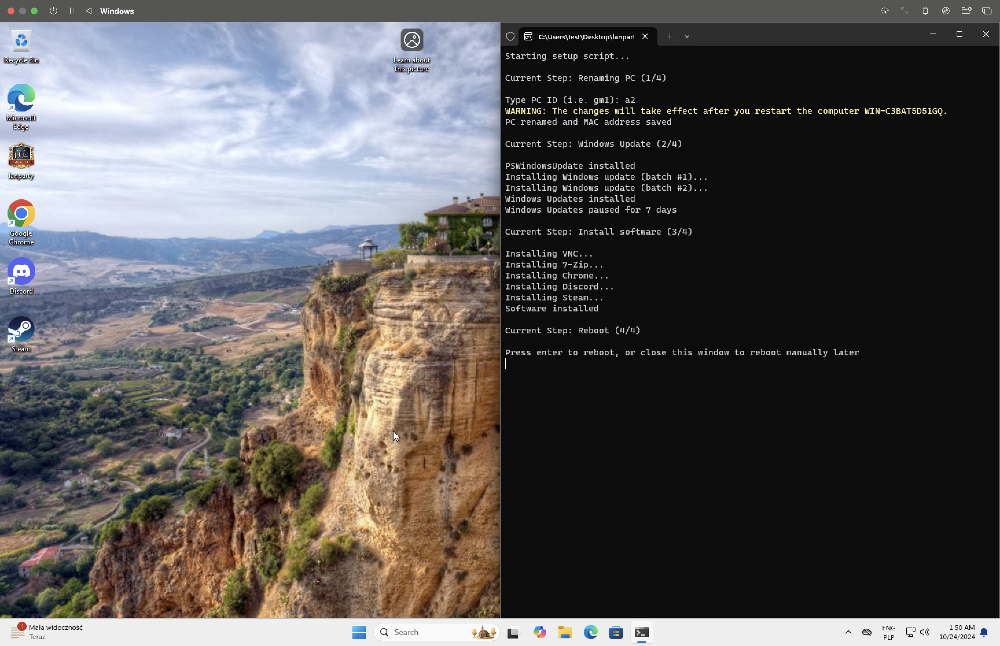

# setup-script

[](../../LICENSE)

PowerShell script to automate the setup of a Windows machine for the [EU4 Grandest LAN](https://www.paradoxinteractive.com/games/europa-universalis-iv/grandest-lan) party.
The script is designed to be run on a fresh Windows installation via a `.exe` file.



#### Features
1. Step 0: Initial setup
   - Define variables, constants, and helper functions
   - Set execution policy to `RemoteSigned` for the current process
   - Install [NuGet](https://www.nuget.org/)
2. Step 1: Rename the PC and save the MAC address in Google Sheet
   - Wait for the user to input the PC ID 
   - Rename the PC to the given PC ID
   - Save the MAC address in a Google Sheet
3. Step 2: Windows Update
   - Install [PSWindowsUpdate](https://www.powershellgallery.com/packages/PSWindowsUpdate) module
   - Install Windows updates
   - Pause updates for 7 days
4. Step 3: Install software using [winget](https://learn.microsoft.com/pl-pl/windows/package-manager/winget/)
   - [TightVNC](https://www.tightvnc.com/)
   - [7Zip](https://www.7-zip.org/)
   - [Google Chrome](https://www.google.com/chrome/)
   - [Discord](https://discord.com/)
   - [Steam](https://store.steampowered.com/)
5. Step 4: Reboot
   - Wait for user input to reboot the PC

## Usage

### Development

You must install the [PS2EXE](https://www.powershellgallery.com/packages/ps2exe) module to convert the script to a `.exe` file.
To install the module and convert the script, run the following command in PowerShell:

```powershell
Set-ExecutionPolicy -ExecutionPolicy RemoteSigned -Scope Process
Install-Module -Name PS2EXE
Invoke-PS2EXE script.ps1 script.exe `
    -iconFile icon.ico `
    -title "EU4 Grandest LAN" `
    -description "Setup script for the EU4 Grandest LAN" `
    -version "1.0.0" `
    -requireAdmin $true
```

The script supports debug mode, which can be enabled by setting the `$debugLevel` variable in the [`script.ps1`](./script.ps1) to `1`.

This script communicates with a Google Sheet to save the MAC address of the PC.
To use this feature, you need to set the `$webhookUrl` and `$webhookToken` variables in the [`script.ps1`](./script.ps1).
To create own sheet and Apps Script Web App, follow the instructions in the [google-sheet-apps-script](../google-sheet-apps-script/README.md) directory.
You can find a read-only example there too.

### Production

This script was designed to be run on a fresh Windows installation via `.exe` file. To do so, you need to:
1. Clone this repository
2. Run `Invoke-PS2EXE script.ps1 script.exe` as described above in the [Development](#development) section.
3. Copy the `.exe` file to the target machine and run it as an administrator.
4. Remove the `.exe` file after the setup is complete.

## License

This project is licensed under the MIT License - see the [LICENSE](../../LICENSE) file for details.

## Author's note

This project was created as part of a larger project to automate the setup of the [EU4 Grandest LAN party](https://github.com/quarties/eu4-grandest-lan-party).
Feel free to open an issue if you have any questions.

PS: This is my first PowerShell script, and I do not even own a Windows machine :see_no_evil:
